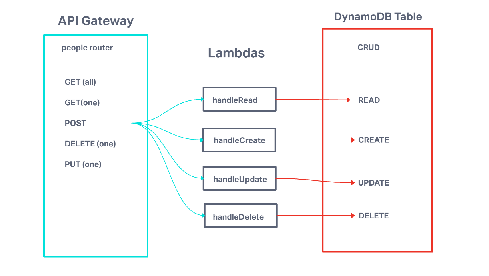

# LAB - Class 18

## Project: Create a serverless REST API.

### Author: Yen Xiong Yuan

### Problem Domain

* Database: DynamoDB 
      - 1 Table required.
      
* Routing: API Gateway  

      - POST
      - /people - Given a JSON body, inserts a record into the database
      - returns an object representing one record, by its id (##)  

      - GET   
      - /people - returns an array of objects representing the records in the database.
      - /people/## - returns an object representing one record, by its id (##).

      - PUT
      - /people/## - Given a JSON body and an ID (##), updates a record in the database.
      - returns an object representing one record, by its id (##).

      - DELETE   
      - /people/## - Given an id (##) removes the matching record from the database
      - returns an empty object.

* CRUD Operation Handlers: Lambda Functions

### Access the link here

- [https://s9yqhhlb4d.execute-api.us-east-1.amazonaws.com/dev/people](https://s9yqhhlb4d.execute-api.us-east-1.amazonaws.com/dev/people)

#### UML

